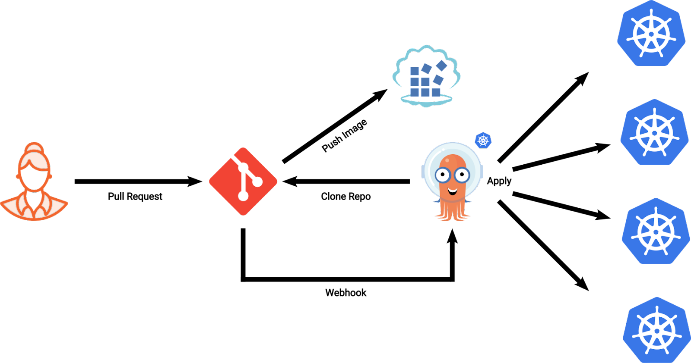

# ArgoCD

ArgoCD는 GitOps로 Source Code와 배포상태가 일치하도록 돕습니다. (Single Source of Truth)

## 다이어그램



레포변경사항 반영시 ArgoCD에 Webhook으로 전달합니다. 변경사항을 확인한 후 Application(CRD)의 따라서 Cluster에 배포 및 동기화 여부를 확인할 수 있습니다.

## 제공하는 것

- 배포된 어플리케이션이 단일 원천소스에서 비롯하며 배포의 정확도를 높입니다.
- 배포 대시보드를 제공합니다.
- 자동 동기화와 수동 동기화 모두 제공합니다.
- 다른 클러스터 배포도 관리할 수 있습니다.

## 사용방법

### 파일위치

`iac/argocd` 참고

### 1. ArgoCD 설치

**secret을 제외한 YAML 설치**

```
kubectl apply -f .
```

**Repo에 접근을 위한 secret 생성**

Vault 사용시에는 `secret/argocd-secret.yaml`을 실행시키면 되지만 vault가 없다면  `privateKey: <privateKey | base64encode>`를 직접 입력해야합니다.

```
kubectl apply -f secret/argocd-secret.yaml
```

### 2. Repository 연결 메카니즘

`secret/argocd-secret.yaml`의 privateKey를 활용하여 인증합니다.

그 후 Configmap에 연결한 Private Repository를 설정합니다.

```
kubectl apply -f argocd-configmap.yaml
```

유의할 점은 위에서 생성한 secret과 동일한 이름을 사용해야합니다.

```
apiVersion: v1
kind: ConfigMap
metadata:
  name: argocd-cm
  labels:
    app.kubernetes.io/name: argocd-cm
    app.kubernetes.io/part-of: argocd
data:
  repositories: |
    - url: git@github.com:ORGANIZATION/argocd.git
      sshPrivateKeySecret:
        name: argocd-ssh # 유의!, 해당 이름은 위에서 생성한 secret 이름과 동일해야합니다.
        key: privateKey
```

### 3. Application 생성

연결된 Repository 설정을 바탕으로 Application(ArgoCD CRD)를 생성합니다.

```
apiVersion: argoproj.io/v1alpha1
kind: Application
metadata:
  name: argo-workflow-dev
  namespace: default
spec:
  project: default
  destination:
    name: in-cluster
    namespace: sample
  source:
    path: iac/argo/dev
    repoURL: git@github.com:ORGANIZATION/argocd.git
    targetRevision: sample
  syncPolicy:
    syncOptions:     # Sync options which modifies sync behavior
    - Validate=false # disables resource validation (equivalent to 'kubectl apply --validate=false') ( true by default ).
    - CreateNamespace=true # Namespace Auto-Creation ensures that namespace specified as the application destination exists in the destination cluster.
    - PrunePropagationPolicy=foreground # Supported policies are background, foreground and orphan.
    - PruneLast=true # Allow the ability for resource pruning to happen as a final, implicit wave of a sync operation
    - ApplyOutOfSyncOnly=true
    - Replace=true
    # The retry feature is available since v1.7
    retry:
      limit: 5 # number of failed sync attempt retries; unlimited number of attempts if less than 0
      backoff:
        duration: 5s # the amount to back off. Default unit is seconds, but could also be a duration (e.g. "2m", "1h")
        factor: 2 # a factor to multiply the base duration after each failed retry
        maxDuration: 3m # the maximum amount of time allowed for the backoff strategy

```

### 4. 접속

localhost:8001로 접속하면 됩니다.

로컬에서 접속시 Port Forwarding이 필요합니다.

```
kubectl port-forward svc/argocd-server 8080:8001
```


## argocd-vault-plugin: K8s Secret을 안전하고 명확하게 관리하는 법

### Requirements

- vault 설치완료
- [argocd-vault-plugin](#ref4) 설치
- [vault approle 생성완료](#ref3)

### argocd-vault-plugin 설치

`argocd-vault-plugin`이 설치된 이미지를 사용합니다.

`AWSACCOUNT.dkr.ecr.ap-northeast-2.amazonaws.com/argocd:argocd-v2.3.3-with-vault` 참고

Dockerfile은 `iac/argo-cd/staging/images/Dockerfile.argocd-repo-server`참고

### 사용예시

#### 0. vault에 kv(key-value) 생성

생성하는 방법은 UI를 통해서 직관적으로 수행할 수 있습니다.

#### 1. secret YAML 생성

생성된 kv를 바탕으로 secret을 생성합니다.
이 때 YAML에는 직접적으로 secret값이 보이지 않고 argocd가 sync시 vault의 값을 조회하여 치환합니다.

```
# 예시
kind: Secret
apiVersion: v1
metadata:
  name: argocd-vault-plugin-credentials
  annotations:
    avp.kubernetes.io/path: "devops/data/argocd-vault-plugin" # vault의 주소
type: Opaque
data:
  AVP_AUTH_TYPE: <AVP_AUTH_TYPE | base64encode> # key 값
  AVP_ROLE_ID: <AVP_ROLE_ID | base64encode> # key 값
  AVP_SECRET_ID: <AVP_SECRET_ID | base64encode> # key 값
  AVP_TYPE: <AVP_TYPE | base64encode> # key 값
  VAULT_ADDR: <VAULT_ADDR | base64encode> # key 값
```

#### 2. GitHub에 Push

해당 secret을 push합니다.


#### 3. Application(ArgoCD CRD)생성

secret용 CRD를 생성합니다.
Plugin을 사용해야합니다.

```
# 생략된 버전
apiVersion: argoproj.io/v1alpha1
kind: Application
metadata:
  name: {name}
  namespace: {namespace}
spec:
  source:
    path: {path}
    repoURL: {repo}
    targetRevision: {branch}
    plugin: # NOTE: Plugin
      name: argocd-vault-plugin
```

#### 4. argocd UI에서 확인하기


## 이미지 배포시 YAML의 변화없이 배포하기: argocd-image-updater

Application(ArgoCD CRD)에 다음과 같은 설정을 통해서 ECR Repository에 새로운 이미지 태그가 푸쉬되면 YAML 변화없이 ArgoCD에서 배포할 수 있습니다.

### Requirements

Appication이 배포하는 것이 Kustomize 혹은 Helm기반이어야합니다.

### 설치방법

`iac/argo-cd/staging/argocd-image-updater` 참고

```
kubectl apply -f .
```

secret은 vault에 적힌 정보를 참고하여 배포하여야합니다.
vault가 있다면 argocd application을 이용하면되고 없다면 해당정보에 맞는 secret을 넣어야합니다.


### 설정방법

Annotation을 통하여 설정할 수 있습니다.

아래 예시는 Semantic Versioning 기반의 설정입니다.

- `argocd-image-updater.argoproj.io/image-list`: 관리하고자하는 이미지와 이미지태그형식을 정합니다.
- `argocd-image-updater.argoproj.io/small-env-service.update-strategy`: `semver` Semantic Versionig 전략을 사용하는 것을 의미합니다.
- `argocd-image-updater.argoproj.io/small-env-service.pull-secret`: `ext:/app/config/ecr.sh` 해당 설정은 고정입니다.
- `argocd-image-updater.argoproj.io/write-back-method: git:secret:default/argocd-image-updater-git-ssh`: 해당 설정을 통해서 관련된 이미지 태그를 변경합니다.

```
# 예시
apiVersion: argoproj.io/v1alpha1
kind: Application
metadata:
  annotations:
    argocd-image-updater.argoproj.io/image-list: sample=AWSACCOUNT.dkr.ecr.ap-northeast-2.amazonaws.com/sample:vx.x.x
    argocd-image-updater.argoproj.io/sample.update-strategy: semver
    argocd-image-updater.argoproj.io/sample.pull-secret : ext:/app/config/ecr.sh
    argocd-image-updater.argoproj.io/write-back-method: git:secret:default/argocd-image-updater-git-ssh
  name: kustomize-test
  namespace: sample
spec:
  destination:
    name: backend-dev
    namespace: sample 
  project: devops
  source:
    path: application/sample/overlays/dev
    repoURL: git@github.com:ORGANIZATION/argocd.git
    targetRevision: main
  syncPolicy:
    retry:
      backoff:
        duration: 5s
        factor: 2
        maxDuration: 3m0s
      limit: 2
    syncOptions:
    - ApplyOutOfSyncOnly=true
    - CreateNamespace=true
    - Replace=true
```

더 다양한 사용방법을 확인하고 싶으시면 [공식문서](#ref5)를 참고하시기 바랍니다.


# Reference

<a name="ref1" href="[Argo CD - Declarative GitOps CD for Kubernetes](https://argo-cd.readthedocs.io/en/stable/)">[1] Argo CD - Declarative GitOps CD for Kubernetes [documents] (2022, 05, 10) </a>

<a name="ref2" href="https://itnext.io/argocd-secret-management-with-argocd-vault-plugin-539f104aff05">[2]Solving ArgoCD Secret Management with the argocd-vault-plugin [documents] (2022, 05, 24) </a>

<a name="ref3" href="https://learn.hashicorp.com/tutorials/vault/approle">[3] AppRole Pull Authentication [documents] (2022, 05, 24) </a>

<a name="ref4" href="https://argocd-vault-plugin.readthedocs.io/en/stable/">[3] argocd vault plugin [documents] (2022, 05, 24) </a>

<a name="ref5" href="https://argocd-image-updater.readthedocs.io/en/stable/">[3] Argo CD Image Updater [documents] (2022, 06, 15) </a>
