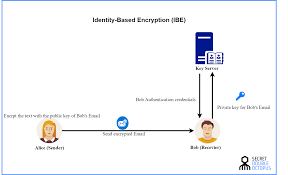

# vault

vault는 Identity-Based Secret과 Encription 관리 시스템이다.
Identity-Based 방법론은 다음과 같이 작동한다.
사용자가 Public Key를 입력하면 신뢰할 수 있는 제 3의 서버가 해당 Public Key를 해석하여 Private Key로 반환해준다.



가장 쉬운예는 GitHub의 Secret 시스템이 있다.

## Requirements

Storage는 S3 저장소를 활용한다.
사용하는 bucket `aws-vault`이다.


## 설치

`iac/vault`를 참고하여 설치한다.

## Auth(인증)

SWK에서 사용하는 인증모드는 총 세 가지이다.

1. root계정의 Token
2. GitHub 계정 연동
```aidl
vault auth enable github
vault write auth/github/config organization=YOUR_ORGANIZATION
```
3. Approle을 활용한 argocd-vault-plugin(role_id: `argocd-vault-plugin`)


## Policy

계정은 Policy에 따라서 권한이 제한된다.
각 팀은 다른팀의 Secret을 볼 수 없도록 Policy를 설정한다.


# Reference

<a name="ref1" href="https://www.vaultproject.io/docs">[1] [vault] [Documentation] (2022, 05, 24) </a>